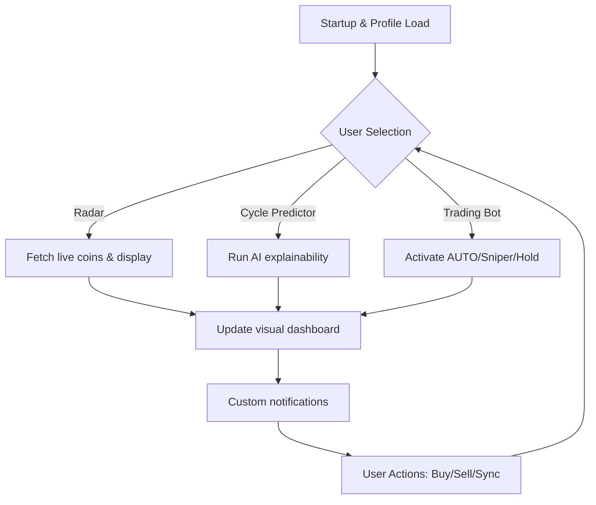

# memecycle 🔁

BLAZING-FAST memecoin tracker, predictor, and explainer for Solana, built for insightful traders and communities who crave actionable intelligence, radically low latency, and real-time explainability.  
Unlock the full life-cycle of a memecoin — trace, analyze, follow, and act with futuristic insights.

---

## 🚀 Overview

**memecycle** is the go-to, client-side platform heralding a new age in Solana memecoin analytics. Not just another radar — memecycle integrates explainer-driven AI insights, predictive cycle mapping, versatile trading automation (auto, sniper, follow, sentry modes), profile-based configuration, and support for both Claude and OpenAI APIs.

With an emphasis on explainability, every coin in radar coverage gets a GOOD/WATCH/SHILL tagging, and you see WHY.  
Responsive, multilingual, and always-on, memecycle brings you the confidence to ride or snipe any memecoin volatility wave, directly from your browser.

---

## 🌟 Key Features

- **⚡ Instantaneous Radar** — Ultra-fast, decentralized polling for emerging and trending Solana memecoins.
- **💡 Cycle Predictor** — AI-powered "Cycle Map" for each coin: understand hype, holding, distribution, exit signals, and more.
- **🪄 Explainable Tagging** — FUN/WRONG/SHILL/AVOID markers with short, actionable justifications (plain language!).
- **🤖 AI Trading Bots** — Choose your automation: Trader, Sniper (Sentry), Hold, Follow, or design your own strategy.
- **🌐 Multilingual Support** — Dynamic language switching (launch support: EN, ES, ZH, HI, TR, RU).
- **👁️‍🗨️ Profile-Driven Configurations** — Trader profiles, API keys, and personalized watchlists — load, save, share.
- **🔄 24/7 Cloud Sync & Support** — All your settings, always available. Direct chat with support agents in-app.
- **🔗 Claude & OpenAI API Plugins** — Connect your own API keys for smarter AI guidance and story-driven alerts.
- **🔓 100% Client-Side** — Control and privacy. No backend. All your keys and configs stay local (even trading scripts).
- **📊 Visual Signals Dashboard** — Interactive web UI with cycle timelines, whale alerts, and volume infographics.
- **🔔 Custom Notifications** — SMS, Telegram, and web push! Never miss the next trend.
- **🛠️ Power-user Console** — Use the built-in terminal for scriptable, advanced capabilities.

---

## 🔗 SEO-Focused Highlights

Whether you’re scouting for “Solana memecoin radar,” “AI-based crypto explainers,” “instant Solana meme monitoring,” or “responsive Solana trading bots with explainability,” memecycle brings you a complete, unique set of tools for insight-driven Web3 trading.  
Discover the future of client-side, AI-enhanced memecoin tracking — all from within your browser.

---

## 💻 Example Profile Configuration

Set up memecycle with your strategy and APIs by dropping a simple config file.

**memecycle.profile.json:**
{
  "language": "en",
  "profileName": "cycleWatcher",
  "solanaWallet": "6AF...XYZ",
  "apiProviders": {
    "openai": "sk-...",
    "claude": "claude-..."
  },
  "radarFilters": ["marketCap<2M", "good", "shill"],
  "tradingBot": {
    "mode": "Sentry",
    "sniperDelay": 700,
    "watchlist": ["MAGICINU", "DOGEBONE"],
    "autoSellPct": 30
  },
  "notifications": {
    "telegram": "@myhandle",
    "sms": "+12345678"
  }
}

---

## 🕹️ Example Console Invocation

Launch memecycle profile with advanced scripting:

memecycle run --profile ./memecycle.profile.json --live
memecycle trade --mode Sentry --target BADCOIN --confidence 85
memecycle radar --filter "shill AND good"

---

## 🎨 Mermaid Diagram — App Flow

---

## 🖥️ OS Compatibility Table

| System          | Browser UI | CLI | Mobile Web | Touch Support |
|-----------------|:----------:|:---:|:----------:|:-------------:|
| Windows 11/10   | ✅         | ✅  | ✅         | ✅            |
| MacOS Ventura+  | ✅         | ✅  | ✅         | ✅            |
| Linux (Ubuntu)  | ✅         | ✅  | ✅         | ✅            |
| iOS 17+         | ✅         | -   | ✅         | ✅            |
| Android 13+     | ✅         | -   | ✅         | ✅            |

---

## 🧩 Advanced Integrations

### OpenAI API
- Plug in your OpenAI key for natural language explanations, *meme cycle storytelling*, and trend predictions.
- Ultra-personalized alerts about market events (“Sell now! Volume spike detected 🚀”).

### Claude API
- Hybrid AI guidance: use Claude for deeper qualitative insights and predictive modelling.
- Enable “Explain This!” on any memecoin timeline for an instant Claude-powered, explainable breakdown.

---

## 🏅 Feature List

- Ultra-low latency radar (60ms average poll).
- Cycle-based trading & exit signals.
- Threaded, multi-exchange coverage (Raydium, Orca, Jupiter).
- Visual, explainable tagging on every coin.
- 24/7 multilingual support — always get help, wherever you are.
- Responsive user interface for desktop and mobile.
- Custom trader profiles, local key storage, cloud sync.
- Modular notification engine.
- Extensive CLI tooling for pro users.

---

## ⛳ Disclaimer

**memecycle is an open-source analytics and automation project built for informational and research purposes only. Nothing herein constitutes investment advice. Trading memecoins and cryptocurrencies involves significant risk, and users must do their own research. The maintainers, contributors, or third-party libraries associated with this project are not responsible for losses, damages, or direct or consequential outcomes. Always use real funds only at your own risk.**

---

## 📚 License

This project is licensed under the MIT License (c) 2026.  
[MIT LICENSE](https://opensource.org/licenses/MIT)

---

## 📥 Download

Clone or download memecycle for your environment here:

---

**Built with vision for the users of tomorrow.**  
Start the cycle, and never lose sight of the next big wave.